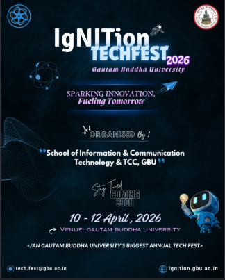

# Sai University Tech Fest 2026 — HTML & CSS Website

A college web-development project for **Sai University Tech Fest 2026**, created using **HTML5 and CSS3**.  
The website presents the event introduction, highlights, competitions, event schedule, participant registration form, poster, navigation links, and footer information.

> **Project type:** Academic Web Development Project  
> **Author:** Suhaas Sarabu  
> **Institution:** Sai University, Chennai, Tamil Nadu

---

## 📌 Project Overview

The **Sai University Tech Fest 2026** website is a structured event webpage developed to demonstrate practical use of HTML5 and CSS3.

The HTML document defines the page structure and content, while an external `index.css` file controls the visual presentation. The HTML includes semantic sections, navigation links, headings, lists, articles, a table, form controls, an image, and a footer.

The page title is **“Sai University Tech Fest 2026”**, and the main tagline used throughout the project is **“Innovate - Build - Compete.”**

---

## 🎯 Objectives

The main objectives of this project are:

- To create a complete event webpage using HTML5.
- To organize content using semantic HTML elements.
- To demonstrate internal navigation using anchor links.
- To create and format an event schedule using an HTML table.
- To build a participant registration form using different HTML5 input types.
- To display the Tech Fest poster using an image element.
- To apply external CSS styling through `index.css`.
- To demonstrate CSS selectors, classes, IDs, colors, spacing, borders, and typography.
- To create a clear and organized webpage suitable for an academic Tech Fest project.

---

## 🛠️ Technologies Used

### HTML5

The project uses:

- HTML document structure
- Semantic elements such as `<header>`, `<main>`, `<section>`, `<article>`, and `<footer>`
- Headings and paragraphs
- Ordered and unordered lists
- Hyperlinks
- HTML tables
- HTML forms
- Text formatting elements
- HTML5 input types
- Image embedding
- Internal page navigation

The HTML document also includes the viewport meta tag and connects to the external stylesheet `index.css`.

### CSS3

The external stylesheet demonstrates:

- Element selectors
- Class selectors
- ID selectors
- Background colors
- Text colors
- Font sizing
- Padding
- Margins
- Borders
- Text alignment
- Form styling
- Event-card styling
- Footer styling
- Image styling

---

## 📂 Project Structure

```text
Sai-University-Tech-Fest/
│
├── index(5).html
├── index(1).css
├── poster(1).png
└── README.md
```

For a clean GitHub repository, the files can be renamed to:

```text
Sai-University-Tech-Fest/
│
├── index.html
├── index.css
├── poster.png
└── README.md
```

---

## 🧱 Website Structure

The webpage is organized into the following major sections:

```text
Header
│
├── Tech Fest Title
├── Tagline
└── Navigation
    ├── About The Event
    ├── Schedule
    ├── Competitions
    └── Register For The Event
│
Main
│
├── About The Event
├── Event Highlights
├── Event Participation
├── Competitions
├── Event Schedule
├── Registration Form
└── Tech Fest Poster
│
Footer
├── Event Name
├── Tagline
├── University Information
├── Email
├── Phone
└── Navigation Links
```

---

## 🏫 Header and Navigation

The header contains the main project title:

```html
<h1 class="heading">Sai University Tech Fest 2026</h1>
```

The project tagline is:

```html
<strong>Innovate - Build - Compete</strong>
```

The navigation uses internal anchor links to move between sections of the same webpage:

```html
<nav class="class2">
    <a href="#about">
        <button class="button">About The Event</button>
    </a>

    <a href="#schedule">
        <button class="button">Schedule</button>
    </a>

    <a href="#competitions">
        <button class="button">Competitions</button>
    </a>

    <a href="#register">
        <button class="button">Register For The Event</button>
    </a>
</nav>
```

This demonstrates how HTML IDs and anchor links can be used for internal page navigation.

---

## 📖 About The Event

The About section introduces the Tech Fest and contains:

- Event name
- Event description
- Emphasized text
- Highlighted invitation
- Date information
- Venue information

Example:

```html
<section id="about">
    <h2 class="section-title">About The Event</h2>

    <h3>Sai University Tech Fest 2026</h3>

    <p>
        Hi Everyone. In our university, we are conducting a
        <strong>Tech Fest</strong> this year.
    </p>

    <p>
        In this event, participants are going to
        <em>Innovate, Build and Compete</em> with others.
    </p>
</section>
```

---

## 📋 Event Highlights

The project uses an unordered list to display major activities:

```html
<ul>
    <li>Inauguration</li>
    <li>Coding Challenge</li>
    <li>Tech Quiz</li>
    <li>Project Exhibition</li>
    <li>Prize Distribution</li>
</ul>
```

An ordered list is also used to explain the participation process:

```html
<ol>
    <li>Visit the Registration Section</li>
    <li>Enter Your Details</li>
    <li>Choose Your Interested Event</li>
    <li>Check Your Details Once</li>
    <li>Submit the Form</li>
</ol>
```

---

## 🏆 Competitions

The competition section uses semantic `<article>` elements and CSS classes.

### Coding Challenge

Tests programming and problem-solving skills.

### Web Design Challenge

Focuses on designing and developing an attractive webpage using HTML.

### Technology Quiz

Contains questions related to technology and computing.

### Innovation Showcase

Provides an opportunity to present innovative ideas and technology projects.

Example structure:

```html
<article class="event-card featured">
    <strong>Coding Challenge</strong>
    <p>Test your programming and problem-solving skills.</p>
</article>
```

The `featured` class gives the selected event a different visual treatment.

---

## 🕐 Event Schedule

The project includes a four-column HTML table containing:

- Time
- Event
- Venue
- Coordinator

| Time | Event | Venue | Coordinator |
|---|---|---|---|
| 09:00 AM | Opening Ceremony | Main Auditorium | Event Committee |
| 10:00 AM | Coding Challenge | Computer Lab | Technical Team |
| 11:30 AM | Innovation Showcase | Innovation Hall | Innovation Team |
| 01:00 PM | Technology Quiz | Seminar Hall | Quiz Committee |
| 02:30 PM | Web Design Challenge | Digital Lab | Design Team |
| 04:00 PM | Prize Distribution | Main Auditorium | Event Committee |

The table uses `<caption>`, `<thead>`, `<tbody>`, `<tr>`, `<th>`, and `<td>`.

---

## 📝 Registration Form

The registration section demonstrates several HTML5 form controls.

### Fields included

- Full Name
- Email Address
- Mobile Number
- Age
- Event Selection
- Participation Type
- Technical Skills
- Preferred Event Date
- Portfolio URL
- Comments / Additional Information

### HTML5 input types demonstrated

```html
<input type="text">
<input type="email">
<input type="tel">
<input type="number">
<input type="radio">
<input type="checkbox">
<input type="date">
<input type="url">
<textarea></textarea>
<select></select>
```

The form also uses HTML validation through the `required`, `min`, and `max` attributes.

Example:

```html
<input
    class="form-control"
    type="number"
    id="age"
    name="age"
    min="16"
    max="30"
    required>
```

The form provides both **Submit Registration** and **Reset** buttons.

> **Important:** The supplied project contains the front-end form structure only. There is no backend/database processing code in the supplied HTML/CSS.

---

## 🖼️ Tech Fest Poster

The project displays the Tech Fest poster using:

```html

```

The poster is styled using the `.event-image` CSS class.

---

## 🎨 CSS Implementation

The external stylesheet defines the overall visual design.

### Body Styling

```css
body {
    font-family: Arial, sans-serif;
    background-color: rgb(214, 169, 139);
    color: black;
    padding: 0;
    margin: 0;
}
```

### Heading Styling

```css
.heading {
    font-size: 40px;
    text-align: center;
}
```

### Event Card Styling

```css
.event-card {
    background-color: white;
    color: black;
    border: 2px solid rgb(150, 56, 33);
    padding: 15px;
    margin: 10px;
}
```

### Form Styling

```css
.form {
    text-align: center;
    background-color: rgb(21, 248, 191);
    padding: 20px;
}
```

### Footer Styling

```css
.footer {
    background-color: black;
    color: white;
    padding: 20px;
    text-align: center;
}
```

The stylesheet also contains selectors for the table, caption, buttons, event information, form controls, image, and individual page sections.

---

## 🔗 Internal Navigation

The following section IDs are used for navigation:

```text
#about
#schedule
#competitions
#register
```

For example:

```html
<a href="#competitions">Competitions</a>
```

This allows users to move directly to the competition section.

---

## 📱 HTML Viewport

The HTML document includes:

```html
<meta name="viewport" content="width=device-width, initial-scale=1.0">
```

This provides an appropriate viewport configuration for displaying the webpage on different screen sizes.

---

## 🚀 How to Run the Project

### Method 1 — Open Locally

1. Keep the HTML, CSS, and poster files in the same project folder.
2. Make sure the image path in the HTML matches the actual poster filename.
3. Open `index.html` in a modern browser.
4. Use the navigation buttons to move between sections.

### Method 2 — GitHub Pages

1. Create a GitHub repository.
2. Upload:
   - `index.html`
   - `index.css`
   - `poster.png`
3. Go to **Settings → Pages**.
4. Select the repository branch.
5. Enable GitHub Pages.
6. Open the generated live website link.

---

## 🧪 Testing Checklist

Before submitting the project, verify:

- [ ] The webpage opens without HTML errors.
- [ ] The CSS file is correctly linked.
- [ ] All navigation links work.
- [ ] The competition section is displayed correctly.
- [ ] The schedule table is readable.
- [ ] All form controls appear correctly.
- [ ] Required form fields perform browser validation.
- [ ] The poster loads correctly.
- [ ] Footer navigation links work.
- [ ] The project works in a modern web browser.

---

## 📚 Learning Outcomes

After completing this project, the following concepts are demonstrated:

1. HTML document structure.
2. Semantic HTML.
3. Headings and text formatting.
4. Lists.
5. Tables.
6. Forms and input types.
7. HTML validation attributes.
8. Internal navigation.
9. Images.
10. External CSS.
11. Element, class, and ID selectors.
12. Colors, borders, margins, and padding.
13. Basic webpage organization.

---

## ⚠️ Current Project Scope

This version is a **front-end HTML5 and CSS3 academic project**.

It does not include:

- JavaScript functionality
- Server-side processing
- Database connectivity
- Online registration storage
- User authentication
- Payment processing

The registration form is therefore a demonstration of HTML form design and browser-side validation.

---

## 👨‍💻 Author

**Suhaas Sarabu**  
Sai University  
Chennai, Tamil Nadu

---

## 📜 License

This project is created for **educational and academic purposes**.
